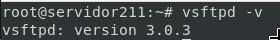
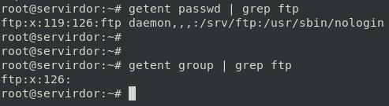
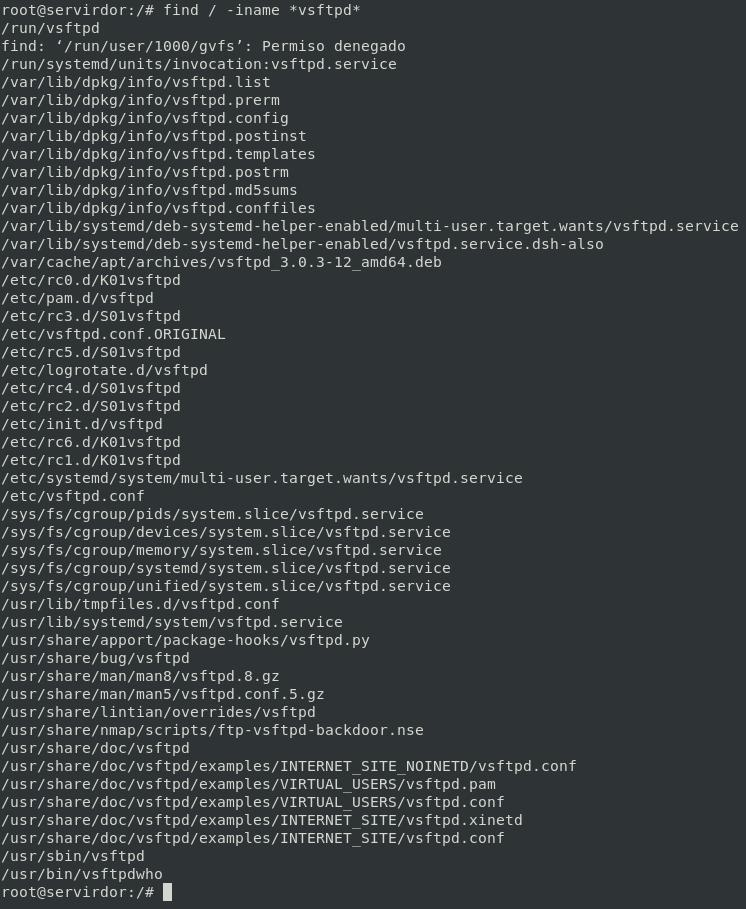

# Casos Prácticos ⌨️🖱️

## Versión de Nginx instalado.

```bash
vsftpd -v
```



## Usuarios creados en la instalación.



## Servicio asociado.

```bash
systemctl status vsftpd.service
```
ó

```bash
/etc/init.d/vsftpd status
```


## Ficheros de configuración.

Principalmente casi toda la configuración de vsftpd está en: `/etc/vsftpd.conf`

```bash
find / -iname *vsftpd*
ls -l /etc/vsftpd.conf
```



### Explicación de las directivas más importantes.

LOREM IPSUM LOREM IPSUMLOREM IPSUMLOREM IPSUMLOREM IPSUMLOREM IPSUMLOREM IPSUMLOREM IPSUMLOREM IPSUMLOREM IPSUMLOREM IPSUMLOREM IPSUMLOREM IPSUMLOREM IPSUMLOREM IPSUMLOREM IPSUMLOREM IPSUMLOREM IPSUMLOREM IPSUMLOREM IPSUMLOREM IPSUMLOREM IPSUMLOREM IPSUMLOREM IPSUMLOREM IPSUMLOREM IPSUMLOREM IPSUMLOREM IPSUMLOREM IPSUMLOREM IPSUMLOREM IPSUMLOREM IPSUMLOREM IPSUMLOREM IPSUMLOREM IPSUMLOREM IPSUMLOREM IPSUMLOREM IPSUMLOREM IPSUMLOREM IPSUMLOREM IPSUMLOREM IPSUMLOREM IPSUMVLOREM IPSUMLOREM IPSUMLOREM IPSUMLOREM IPSUMLOREM IPSUMLOREM IPSUMLOREM IPSUMLOREM IPSUMLOREM IPSUMLOREM IPSUMLOREM IPSUMLOREM IPSUMLOREM IPSUMLOREM IPSUM

## Configuraciones Avanzadas

## [Acceso al servidor FTP: usuarios del sistema.](CasosPracticosApartados/AccesoUsuariosDelSistema.md)
## [Acceso al servidor FTP: anónimo Lectura](CasosPracticosApartados/anonimoLecutura.md)
## [Acceso al servidor FTP: anónimo Escritura/Lectura](CasosPracticosApartados/anonimoEscrituraLectura.md)
________________________________________
*[Volver al índice...](../README.md)*