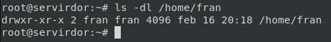

# E) Acceso al servidor FTP: usuarios del sistema 🖥️

## Crear Usuario

Vamos a crear un usuario en el sistema para esta práctica

```bash
adduser fran
ls -l /home/fran
```




```bash
cp /etc/vsftpd.conf /etc/vsftpd.conf.ORIGINAL
```

## Enjaular usuarios

De manera predeterminada, vsftpd no permite la escritura en el directorio chroot jail, por razones de seguridad. Usaremos la opción `allow_writeable_chroot = YES` para anular esta configuración. y `chroot_local_user=YES` para enjaularlos en su directorio de inicio predeterminado. 

*Añadimos o descomentamos la siguiente directiva:*

```conf
chroot_local_user=YES
allow_writeable_chroot=YES
```

```bash
echo "chroot_local_user=YES" >> /etc/vsftpd.conf
echo "allow_writeable_chroot=YES" >> /etc/vsftpd.conf
```

*Reiniciamos el servicio*

```bash
systemctl restart vsftpd
systemctl status vsftpd
```


________________________________________
*[Volver atrás...](../CasosPracticos.md)*

*[Ir a Siguiente punto...](./anonimoLecutura.md)*