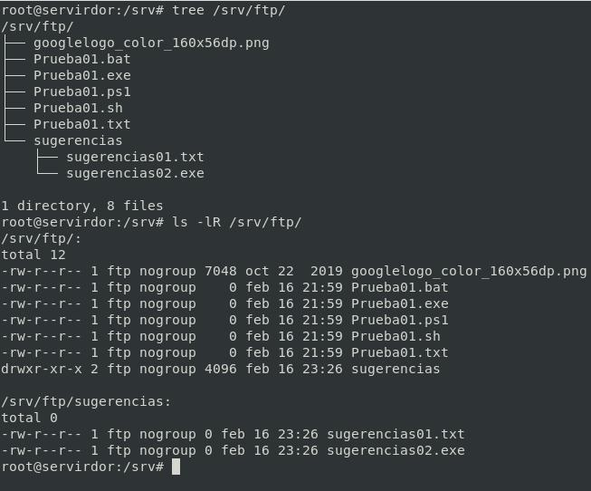
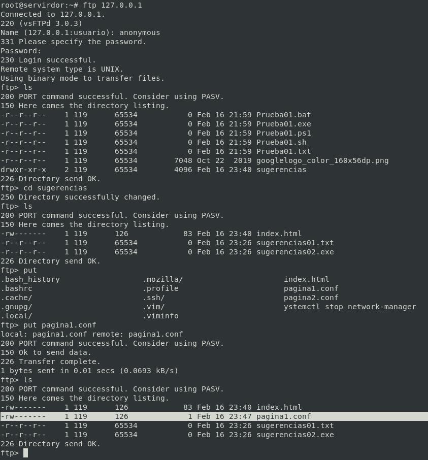

# G) Acceso al servidor FTP: anónimo Escritura/Lectura 📃  📝

## Directivas del Usuario Anónimo

|Directivas  | Descripción  |
|:---------:|---------|
|anon_mkdir_write_enable|Cuando se activa en combinación con la directriz write_enable, los usuarios anónimos pueden crear nuevos directorios dentro de un directorio que tiene permisos de escritura. El valor predeterminado es NO.|
|anon_root|Especifica el directorio al cual vsftpd cambia luego que el usuario anónimo se conecta. Esta directriz no tiene un valor predeterminado.|		 
|anon_upload_enable|Cuando se usa con la directriz write_enable, los usuarios anónimos pueden cargar archivos al directorio padre que tiene permisos de escritura. El valor predeterminado es NO.| 
|anon_world_readable_only|Si está activada, los usuarios anónimos solamente pueden descargar archivos legibles por todo el mundo. El valor por defecto es YES|
|ftp_username|Especifica la cuenta del usuario local (listada en /etc/passwd) utilizada por el usuario FTP anónimo. El directorio principal especificado en /etc/passwd para el usuario es el directorio raíz. El valor por defecto es ftp.|
|no_anon_password|Cuando está activada, no se le pide una contraseña al usuario anónimo. El valor predeterminado es NO.|
|secure_email_list_enable|Cuando está activada, solamente se aceptan una lista de contraseñas especificadas para las conexiones anónimas. Esto es una forma conveniente de ofrecer seguridad limitada al contenido público sin la necesidad de usuarios virtuales. Se previenen las conexiones anónimas a menos que la contraseña suministrada esté listada en /etc/vsftpd.email_passwords. El formato del archivo es una contraseña por línea, sin espacios al comienzo. El valor predeterminado es NO|


## Probar con la configuración por defecto

```bash
ftp 127.0.0.1
```


## Configurar acceso a usuario Anonymous

El servidor vsftpd está configurado de manera predeterminada de forma que el usuario solo puede iniciar sesión en el servidor FTP con una cuenta específica(usuarios del sistema). 


*Añadimos o descomentamos la siguiente directiva:*

```yml
write_enable=YES
anon_upload_enable=YES
anon_mkdir_write_enable=YES
anon_other_write_enable=YES
```

las directivas de anon_upload, anon_mkdir_write,etc depende de `write_enable=YES` (Más detalle en la tabla de directivas al principio de este documento)

```bash
mkdir /srv/ftp/sugerencias
cd /srv/ftp/sugerencias
# Añadimos algunos datos
touch sugerencias01.txt
touch sugerencias02.exe
chown -R ftp:nogroup /srv/ftp/sugerencias
# Quitamos permisos de escritura a raíz de anonymous
chmod -R u-w /srv/ftp
chmod -R u+w /srv/ftp/sugerencias
echo "write_enable=YES" >> /etc/vsftpd.conf
echo "anon_upload_enable=YES" >> /etc/vsftpd.conf
echo "anon_mkdir_write_enable=YES" >> /etc/vsftpd.conf
echo "anon_other_write_enable=YES" >> /etc/vsftpd.conf
```

> [!Advertencia]: El usuario, en este caso ftp, no puede tener permisos de escritura sobre el directorio en el que se enjaula. (ESTO NO ES UNA RECOMENDACIÓN, SINÓ QUE ES PARTE DEL FUNCIONAMIENTO VSFTPD, AL INTENTARLO DARÁ ERRORES DE ACCESO)

*Reiniciamos el servicio*

```bash
systemctl restart vsftpd
systemctl status vsftpd
```

### Ficheros:



## Acceso con Anonymous

```bash
ftp 127.0.0.1
```



________________________________________
*[Volver atrás...](../CasosPracticos.md)*

*[Ir a Siguiente punto...](./anonimoEscrituraLectura.md)*