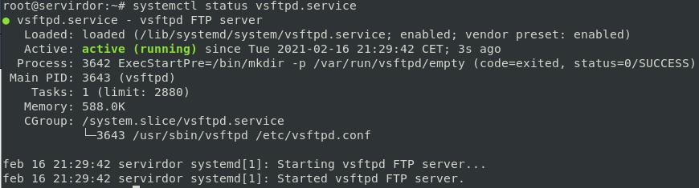
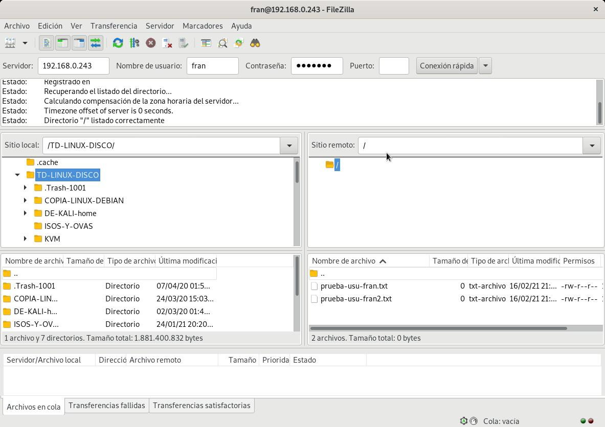

# F) Acceso al servidor FTP: anónimo Lectura 📃

Anónimo solo tendrá permiso de lectura en su directorio de trabajo.

## Probar con la configuración por defecto


```bash
ftp 127.0.0.1
```

.
connect_from_port_20=YES
#
secure_chroot_dir=/var/run/vsftpd/empty
#
pam_service_name=vsftpd
#
rsa_cert_file=/etc/ssl/certs/ssl-cert-snakeoil.pem
rsa_private_key_file=/etc/ssl/private/ssl-cert-snakeoil.key
ssl_enable=NO
#
```

## Configurar acceso a usuario Anonymous

El servidor vsftpd está configurado de manera predeterminada de forma que el usuario solo puede iniciar sesión en el servidor FTP con una cuenta específica(usuarios del sistema). 


*Añadimos o descomentamos la siguiente directiva:*

```conf
anonymous_enable=YES
```

```bash
echo "anonymous_enable=YES" >> /etc/vsftpd.conf
```

## Enjaular usuarios

De manera predeterminada, vsftpd no permite la escritura en el directorio chroot jail, por razones de seguridad. Usaremos la opción `allow_writeable_chroot = YES` para anular esta configuración. y `chroot_local_user=YES` para enjaularlos en su directorio de inicio predeterminado. 


```bash
echo "chroot_local_user=YES" >> /etc/vsftpd.conf
echo "allow_writeable_chroot=YES" >> /etc/vsftpd.conf
```

*Reiniciamos el servicio*

```bash
systemctl restart vsftpd
systemctl status vsftpd
```





________________________________________
*[Volver atrás...](../CasosPracticos.md)*

*[Ir a Siguiente punto...](./anonimoLecutura.md)*