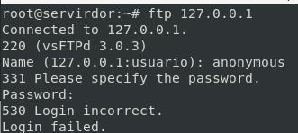
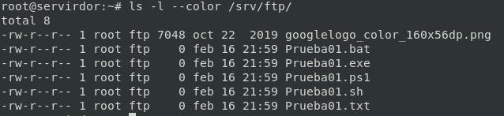
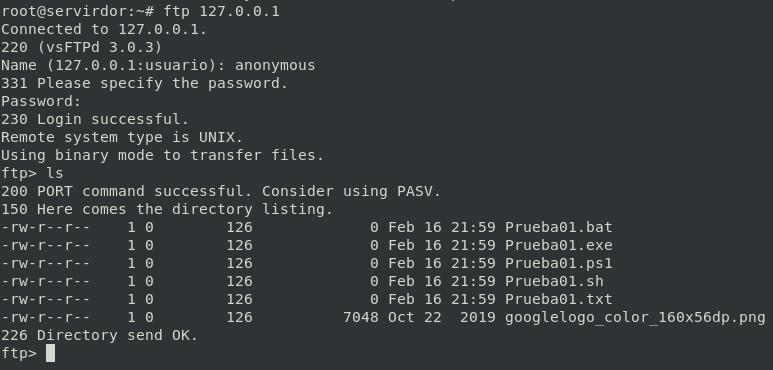

# F) Acceso al servidor FTP: anónimo Lectura 📃

Anónimo solo tendrá permiso de lectura en su directorio de trabajo.

## Probar con la configuración por defecto


```bash
ftp 127.0.0.1
```



*Configuración actual por defecto:*

```yml
listen=YES
#
listen_ipv6=NO
anonymous_enable=NO
#
local_enable=YES
#
dirmessage_enable=YES
#
use_localtime=YES
#
# Activate logging of uploads/downloads.
xferlog_enable=YES
#
# Make sure PORT transfer connections originate from port 20 (ftp-data).
connect_from_port_20=YES
#
secure_chroot_dir=/var/run/vsftpd/empty
#
pam_service_name=vsftpd
#
rsa_cert_file=/etc/ssl/certs/ssl-cert-snakeoil.pem
rsa_private_key_file=/etc/ssl/private/ssl-cert-snakeoil.key
ssl_enable=NO
#
```

## Configurar acceso a usuario Anonymous

El servidor vsftpd está configurado de manera predeterminada de forma que el usuario solo puede iniciar sesión en el servidor FTP con una cuenta específica(usuarios del sistema). 


*Añadimos o descomentamos la siguiente directiva:*

```conf
anonymous_enable=YES
```

```bash
echo "anonymous_enable=YES" >> /etc/vsftpd.conf
```

## Añadimos algunos datos


```bash
cd /srv/ftp
touch Prueba01.txt
touch Prueba01.bat
touch Prueba01.exe
touch Prueba01.sh
touch Prueba01.ps1
wget https://www.google.es/images/branding/googlelogo/2x/googlelogo_color_160x56dp.png
```

**Damos los permisos y propitarios a los ficheros de la misma manera que vienen por defecto (root:ftp)**

`/srv/ftp`

```bash
chown -R :ftp /srv/ftp/
ls -l --color /srv/ftp/
```



*Reiniciamos el servicio*

```bash
systemctl restart vsftpd
systemctl status vsftpd
```

## Acceso con Anonymous

```bash
ftp 127.0.0.1
```



________________________________________
*[Volver atrás...](../CasosPracticos.md)*

*[Ir a Siguiente punto...](./anonimoEscrituraLectura.md)*