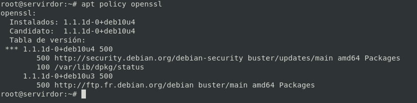
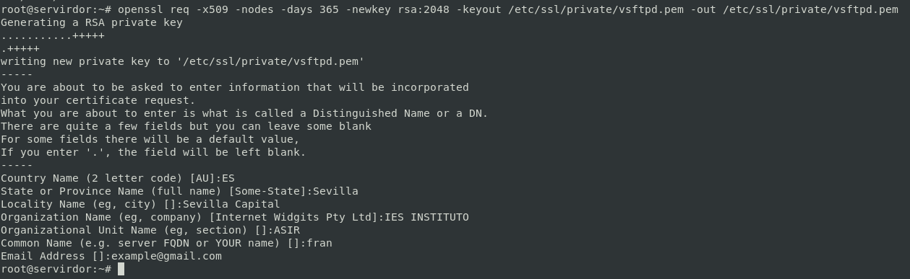
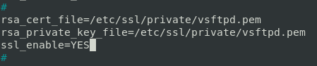
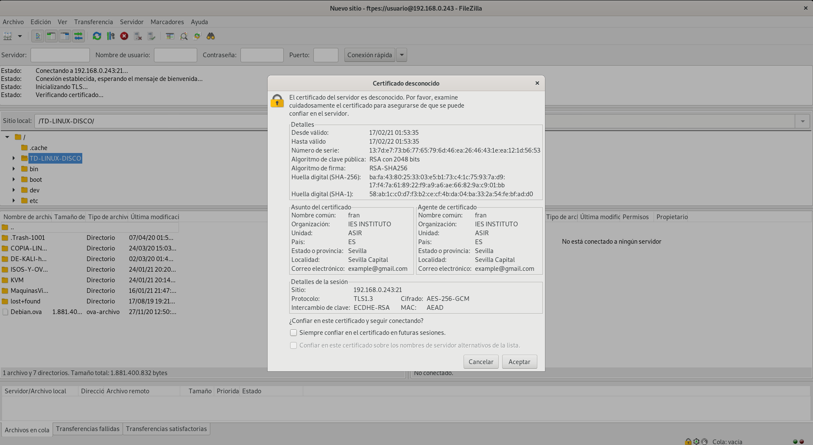

# Acceso seguro al servidor FTP.🔐

## Paquetes Necesarios

Vamos a crear un usuario en el sistema para esta práctica

```bash
apt install openssl
```



## Generar Certificado




## Configuración Certificado




## Configuración

```yml
listen=YES
#
listen_ipv6=NO
anonymous_enable=NO
#
local_enable=YES
#
dirmessage_enable=YES
#
use_localtime=YES
#
# Activate logging of uploads/downloads.
xferlog_enable=YES
#
# Make sure PORT transfer connections originate from port 20 (ftp-data).
connect_from_port_20=YES
#
secure_chroot_dir=/var/run/vsftpd/empty
#
pam_service_name=vsftpd
#
rsa_cert_file=/etc/ssl/private/vsftpd.pem
rsa_private_key_file=/etc/ssl/private/vsftpd.pem
ssl_enable=YES
#
chroot_local_user=YES
allow_writeable_chroot=YES
anonymous_enable=YES
anon_upload_enable=YES
anon_mkdir_write_enable=YES
anon_other_write_enable=YES
write_enable=YES
allow_anon_ssl=YES #IMPORTANTE PARA QUE ANONYMOUS PUEDA ACCEDER
```

*Reiniciamos el servicio*

```bash
systemctl restart vsftpd
systemctl status vsftpd
```

## Acceso vía Filezilla



________________________________________
*[Volver atrás...](../CasosPracticos.md)*

*[Ir a Siguiente punto...](./anonimoLecutura.md)*