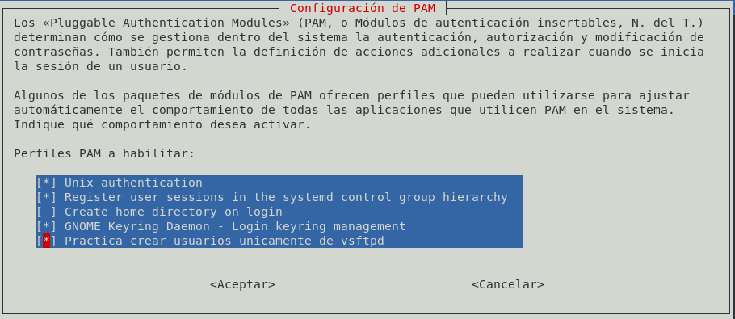
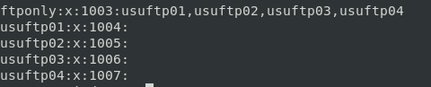

# H) Acceso al servidor FTP: Creación de usuarios virtuales.👥

El propósito, a partir de ahora, es crear usuarios cuyo único propósito es el acceso al FTP, por lo que no serán válidos para el resto de los servicios.

Denominados falsamente virtuales, porque no son virtuales, ya que son usuarios que realmente existen en el sistema ,es decir, que getent passwd los reconoce. A pesar de ello, manipulamos la autenticación para que sean incapaces de autenticarse en ningún otro servicio. La tarea, por tanto, se reduce a configurar PAM para lograrlo.

Caracterizar usuarios de manera que sólo ellos cumplan los requisitos necesarios para el FTP unicamente.(Para dirigirme a todos estos usurios podría usar 2 métodos, referirme a ellos creandolos en un rango de UIDs o añadiendolos a un grupo, este ultimo me parece mas práctico).

## Crear grupo

Añadiremos a él los usuarios de FTP falsamente virtuales.

```bash
addgroup --system ftponly
```

## Impedirle el acceso al resto de usuarios

*Configuración:*

```conf
Name: Practica crear usuarios unicamente de vsftpd
Default: no
Priority: 0
Account-Type: Additional
Account:
	[success=1 default=ignore]	pam_succeed_if.so service = vsftpd
	required			pam_listfile.so item=group sense=deny onerr=succeed file=/etc/vftpusers
	required			pam_permit.so
```


```bash
vi /usr/share/pam-configs/ftponly
```

Actualizamos con:

```bash
pam-auth-update
```

Marcar la entrada que creamos anteriormente (Fijarse en el nombre de la ultima línea marcada es la configuración creada anteriormente)



Impide que cualquier usuario perteneciente a un grupo incluido en el fichero /etc/ftponly pueda autenticarse en un servicio que NO sea vsftpd (EL GRUPO QUE HE CREADO ANTERIORMENTE DEBE SER AÑADIDO A ESTE FICHERO)

echo "ftponly" > /etc/ftponly

**Usuarios:**

```bash
useradd -m --groups ftponly --shell /sbin/nologin usuftp01
useradd -m --groups ftponly --shell /sbin/nologin usuftp02
useradd -m --groups ftponly --shell /sbin/nologin usuftp03
useradd -m --groups ftponly --shell /sbin/nologin usuftp04
```

**Grupo:**



________________________________________
*[Volver atrás...](../CasosPracticos.md)*

*[Ir a Siguiente punto...](./cifrado.md)*