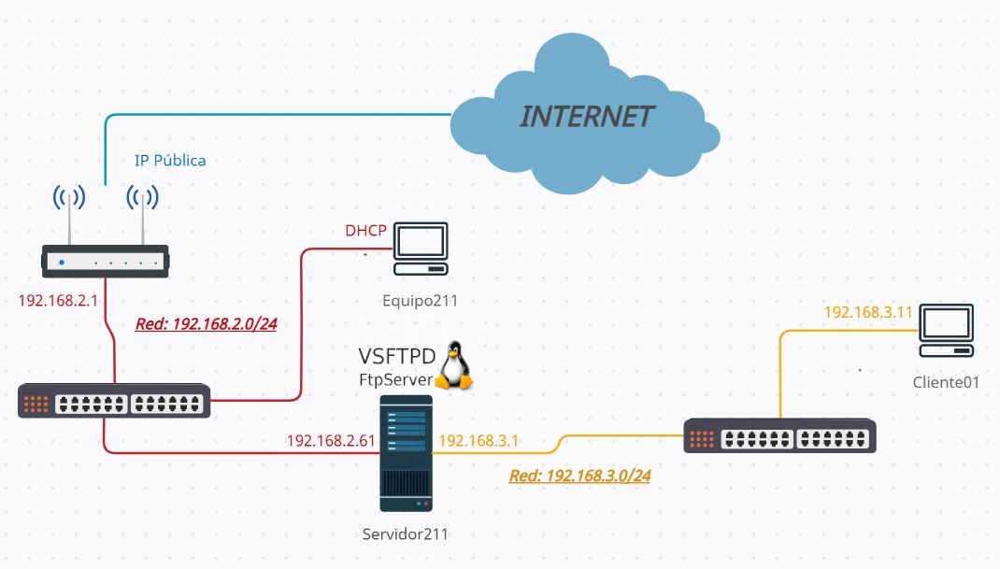

# Esquema de red 🌐

|Equipo                |IP          |Red           |
|:--------------------:|:----------:|:------------:|
|**Router**            |IP Pública  |N/A           |
|**Router**            |192.168.2.1 |192.168.2.0/24|
|**Equipo211**(*Clase*)|Cliente DHCP|192.168.2.0/24|
|**Servidor211**       |192.168.2.61|192.168.2.0/24|
|**Servidor211**       |192.168.3.1 |192.168.3.0/24|
|**Cliente01**         |192.168.3.11|192.168.3.0/24|
________________________________________
*[Volver al índice...](../README.md)*
