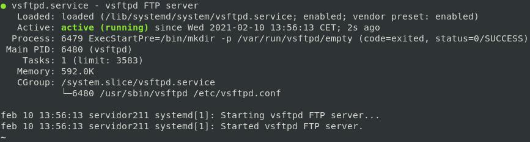

# Instalacion ⌨️🖱️

## Pre-Intalación

*Aconsejo no usar una máquina en la ya exista un servicio web proftpd*
*Si tenemos instalado apache2 aconsejo borrarlo por completo...*

```bash
systemctl stop proftpd.service 
systemctl disable proftpd.service
# SI EXISTEN PROYECTOS Y SERVICIOS EN PRODUCCIÓN CON EL SERVIDOR PROFTPD QUIZÁS
# PREFIERAS HACER UNA COPIA DE SEGURIDAD, VAMOS A ELIMINAR TODO
rm -R -i /etc/proftpd/*
rm -R -i /srv/proftpd/*
apt purge proftpd -y
apt autoremove
```
*Aconsejo no usar máquina en la que ya tuvisemos un servicio web apache*

## Instalación

```bash
apt update
apt-get install vsftpd -y
```

*Este paso lo considero casi obligario durante la instalación por seguridady para poder empezar a usar el servicio FTP*

```bash
cp /etc/vsftpd.conf /etc/vsftpd.conf.ORIGINAL
echo "chroot_list_enable=YES" >> /etc/vsftpd.conf
echo "chroot_list_file=/etc/vsftpd.chroot_list" >> /etc/vsftpd.conf
echo "write_enable=YES" >> /etc/vsftpd.conf
echo "allow_writeable_chroot=YES" >> /etc/vsftpd.conf
```

*Descomentamos o añadimos las siguientes estas lineas*

```conf
chroot_list_enable=YES
chroot_list_file=/etc/vsftpd.chroot_list
write_enable=YES
allow_writeable_chroot=YES
```

Activamos el servicio y comprobamos su estado

```bash
systemctl enable vsftpd.service
systemctl restart vsftpd.service
systemctl status vsftpd.service
```


________________________________________
*[Volver al índice...](../README.md)*